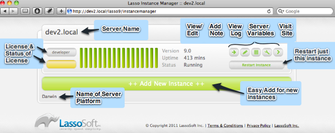

Configuring Lasso 9/Apache 2.4/RHEL and CentOS 6.4
==================================================

This documentation describes how to install and configure an environment that
will allow Lasso 9 to run with a custom installation of Apache 2.4.x on Red Hat
Enterprise Linux 6.4/CentOS 6.4.

Apache 2.2.x is the supported version for RHEL 6.4/CentOS 6.4.  At the time of
this writing, LassoSoft supports only officially supported packages and
libraries of the operating system.  Similarly documentation of how to install
Apache 2.4.x is outside the scope of this documentation.  That's what `tehGoogle <http://bit.ly/1eeNlxl>`_
is for.

This documentation assumes that Apache 2.4 will be installed in
`/usr/local/apache2/`.

Pre-requisites
--------------
* Apache 2.4.x custom installation.
* Valid Lasso 9 license serial (for production servers only).
* User with sudo access on servers.
* Red Hat Network subscription (for RHEL only).

Installation and Configuration
------------------------------

Configure SELinux
^^^^^^^^^^^^^^^^^
Set SELinux permanently to permissive mode because otherwise it conflicts with
Lasso Instance Manager.  Edit `/etc/selinux/config` and replace either of the
following lines::

    SELINUX=enforcing
    SELINUX=disabled

with the following line::

    SELINUX=permissive

Effects will take place at reboot.

Disable the subscription-manager plugins (RHEL only)
^^^^^^^^^^^^^^^^^^^^^^^^^^^^^^^^^^^^^^^^^^^^^^^^^^^^
Edit `/etc/yum/pluginconf.d/subscription-manager.conf`, and change the
following line::

	enabled=1

to::

	enabled=0

Repeat the above step for `/etc/yum/pluginconf.d/product-id.conf`

Disable the rhsmcertd service::

	sudo chkconfig rhsmcertd off
	sudo service rhsmcertd stop

Verify that the message in `yum repolist` has changed to::

	This system is receiving updates from RHN Classic or RHN Satellite

Verify your system version and architecture
^^^^^^^^^^^^^^^^^^^^^^^^^^^^^^^^^^^^^^^^^^^
Determine the version::

    cat /etc/redhat-release

This should return something like the following::

    Red Hat Enterprise Linux Server release 6.4 (Santiago)

Determine the architecture::

    uname -i

This should return something like the following::

    x86_64

If the result is `x86_64` then it is 64-bit architecture.  If the result is
`i386` or `i686` then it is 32-bit architecture.

Configure yum repositories (RHEL only)
^^^^^^^^^^^^^^^^^^^^^^^^^^^^^^^^^^^^^^
Login to the Red Hat Network web management tools.  Add the optional channel
`RHEL Server Optional (v. 6 64-bit x86_64) (Channel Details)` to the allowed
entitlements.

Configure yum repositories (CentOS only)
^^^^^^^^^^^^^^^^^^^^^^^^^^^^^^^^^^^^^^^^
If any of the libraries mentioned in this documentation are not available for
CentOS 6.4, then you must configure your yum repositories accordingly.
`RPMforge <http://wiki.centos.org/AdditionalResources/Repositories/RPMForge#head-f0c3ecee3dbb407e4eed79a56ec0ae92d1398e01>`_ is the authoritative source.

Update the system
^^^^^^^^^^^^^^^^^
Update your RHEL 6.4/CentOS 6.4 64-bit system::

    sudo yum update

Install libzip
^^^^^^^^^^^^^^
libzip is required by Lasso 9.2.  To install::

    sudo yum install libzip

Build the Lasso 9 Connector from source
^^^^^^^^^^^^^^^^^^^^^^^^^^^^^^^^^^^^^^^

The Lasso 9 Connector does not work with Apache 2.4 out of the box, so we must
build it from source on our architecture.

Install Development Tools::

    sudo yum groupinstall "Development Tools"

Install Development tools for the sqlite3 embeddable SQL database engine::

    sudo yum install sqlite-devel.x86_64

Download the source files::

    mkdir ~/packages/lasso9; cd packages/lasso9/;
    wget -r -nH --cut-dirs=5 --no-parent \
    --reject="index.html*" -e robots=off \
    http://source.lassosoft.com/svn/lasso/lasso9_source/trunk/mod_lasso9/

Check the file `mod_lasso.cpp` and edit as necessary.  Look around lines 99-106
for the following::

    #define AP_LOG_FAIL(F,S) \
        ap_log_cerror(__FILE__, __LINE__, APLOG_CRIT, 0, r->connection, F,S);
    #define AP_LOG_FAIL_2(F,S,S2) \
        ap_log_cerror(__FILE__, __LINE__, APLOG_CRIT, 0, r->connection, F,S,S2);
    #define AP_LOG_FAIL_3(F,S,S2,S3) \
        ap_log_cerror(__FILE__, __LINE__, APLOG_CRIT, 0, r->connection, F,S,S2,S3);
    #define AP_LOG_FAIL_4(F,S,S2,S3,S4) \
        ap_log_cerror(__FILE__, __LINE__, APLOG_CRIT, 0, r->connection, F,S,S2,S3,S4);

and replace with::

    #define AP_LOG_FAIL(F,S) \
        ap_log_cerror(__FILE__, __LINE__, APLOG_CRIT, 0, 500, r->connection, F,S);
    #define AP_LOG_FAIL_2(F,S,S2) \
        ap_log_cerror(__FILE__, __LINE__, APLOG_CRIT, 0, 500, r->connection, F,S,S2);
    #define AP_LOG_FAIL_3(F,S,S2,S3) \
        ap_log_cerror(__FILE__, __LINE__, APLOG_CRIT, 0, 500, r->connection, F,S,S2,S3);
    #define AP_LOG_FAIL_4(F,S,S2,S3,S4) \
        ap_log_cerror(__FILE__, __LINE__, APLOG_CRIT, 0, 500, r->connection, F,S,S2,S3,S4);

Note that the only changes are to the fourth argument in each line.  At some
point LassoSoft intends to update this file, but until then it must be updated
manually.

Build mod_lasso9.so::

    make

Copy it to its final destination (wherever you installed Apache 2.4)::

    sudo cp mod_lasso9.so /usr/local/apache2/modules/

Make sure it will load fine::

    sudo /usr/local/apache2/bin/apachectl configtest

And restart Apache::

    sudo /usr/local/apache2/bin/apachectl graceful

Install and Configure Lasso 9
^^^^^^^^^^^^^^^^^^^^^^^^^^^^^
First make a backup copy of `/etc/init.d/httpd`.  The Lasso 9 installer
installs Apache 2.2, which overwrites this file and we'll need to restore it::

    sudo cp /etc/init.d/httpd /etc/init.d/httpd.2.4.3.bkp

See the procedure `CentOS 6 installation with yum
<http://www.lassosoft.com/Lasso-9-Server-Download>`_ provided by LassoSoft,
ensuring that you follow the procedure for the right architecture.

Create the file `/etc/yum.repos.d/CentOS6-Lasso9.repo`.  Edit its contents as
follows::

    [lassosoft]
    name=LassoServer
    failovermethod=priority
    baseurl=http://centos6yum.lassosoft.com/
    enabled=1
    gpgcheck=1
    gpgkey=http://centos6yum.lassosoft.com/RPM-GPG-KEY-lassosoft
    http_caching=packages

Install Lasso 9::

    sudo yum install Lasso-Instance-Manager

Watch the console for the following::

    Starting lassoimd: [  OK  ]
    Stopping httpd: [FAILED]
    Starting httpd: (98)Address already in use: make_sock: could not bind to address [::]:80
    (98)Address already in use: make_sock: could not bind to address 0.0.0.0:80
    no listening sockets available, shutting down
    Unable to open logs
    [FAILED]

    Lasso Instance Manager has been successfully installed.

    To initialize Lasso Instance Manager, please go to this location:

    http://localhost/lasso9/instancemanager

    Lasso Instance Manager can be stopped and started with the following commands:

    sudo /sbin/service lassoimd stop
    sudo /sbin/service lassoimd start

This bit::

    Stopping httpd: [FAILED]
    Starting httpd: (98)Address already in use: make_sock: could not bind to address [::]:80

shows that the installer was unable to stop and start Apache.  This is because
the Lasso 9 installer installs Apache 2.2.15 instead of using the
custom-installed Apache 2.4.  It also overwrites the file `/etc/init.d/httpd`.

First let's restore the backup::

    sudo cp /etc/init.d/httpd /etc/init.d/httpd.2.2.15.bkp
    sudo cp /etc/init.d/httpd.2.4.3.bkp /etc/init.d/httpd

Next let's copy over the Lasso 9 Apache configuration file and make any
necessary changes to include it::

    sudo cp /etc/httpd/conf.d/mod_lasso9.conf /usr/local/apache2/conf/extra/mod_lasso9.conf

Edit `/usr/local/apache2/conf/httpd.conf` by appending the following include::

    # Include the Lasso 9 config
    Include Include conf/extra/mod_lasso9.conf

Check Apache config::

    sudo /usr/local/apache2/bin/apachectl configtest

And if `Syntax OK`, then restart Apache::

    sudo /usr/local/apache2/bin/apachectl restart

When done, visit `http://localhost/lasso9/instancemanager
<http://localhost/lasso9/instancemanager>`_ (or your server host name) to
complete the installation.  See `Lasso 9 Server Instance Manager
<http://www.lassosoft.com/Lasso-9-Server-Instance-Manager>`_.

Enter a new Administrator username and password, and keep the login in a secure
place.  You will be redirected to the Lasso Instance Manager.

Click the "developer" button and enter a valid license.  The instance will
restart.  The license should change from `Developer` to the valid license type.

Click the `>` button to visit the Lasso 9 Instance Administration interface or
visit the URL `http://localhost/lasso9/admin/
<http://localhost/lasso9/admin/>`_.  See `Lasso 9 Instance Administration
<http://www.lassosoft.com/Lasso-9-Server-Administration>`_.

Next we need to set up data sources.  Click the tab on the left side, and click
`Datasources`.  You should see a list of Datasource connectors.  We need to set
up connections for each datasource we will use, so click its name.  Click `Add
host`.  Enter the following values::

    Host = <host>
    Port = <port>
    Enabled = Yes
    Username = <username>
    Password = <password>

Click the `Add Host` button.  The user interface is very misleading and it can
sometimes take up to 2 or 3 minutes for a host to be added, especially when
datasources reside on a remote server.  You should see either a javascript
alert if there is a failure, else if successful the page should refresh and
display the host.  Expand the host to show a list of databases.  Repeat for all
hosts.

Complete Apache Configuration
^^^^^^^^^^^^^^^^^^^^^^^^^^^^^
Next let's configure Apache for the environment.  Several configuration options
are possible, including `Configure Lasso 8 and 9 side-by-side on one server
<http://www.lassosoft.com/Configure-Lasso-8-and-9-Side-by-Side>`_.  We'll
keep it simple.

Edit `/usr/local/apache2/conf/httpd.conf` to enable virtual hosts by
uncommenting the Include as follows::

    # Virtual hosts
    Include conf/extra/httpd-vhosts.conf

Edit `/usr/local/apache2/conf/extra/httpd-vhosts.conf` by commenting out the
examples and adding the directives for virtual host configuration::

    #<VirtualHost *:80>
    #    ServerAdmin webmaster@dummy-host.example.com
    #    DocumentRoot "/usr/local/apache2/docs/dummy-host.example.com"
    #    ServerName dummy-host.example.com
    #    ServerAlias www.dummy-host.example.com
    #    ErrorLog "logs/dummy-host.example.com-error_log"
    #    CustomLog "logs/dummy-host.example.com-access_log" common
    #</VirtualHost>
    #
    #<VirtualHost *:80>
    #    ServerAdmin webmaster@dummy-host2.example.com
    #    DocumentRoot "/usr/local/apache2/docs/dummy-host2.example.com"
    #    ServerName dummy-host2.example.com
    #    ErrorLog "logs/dummy-host2.example.com-error_log"
    #    CustomLog "logs/dummy-host2.example.com-access_log" common
    #</VirtualHost>

    <VirtualHost *:80>
        # myserver
        ServerAdmin webmaster@myserver.com
        DocumentRoot "/var/www/html/www.myserver.com"
        ServerName www.myserver.com
        ServerAlias myserver.com
        ErrorLog logs/www.myserver.com-error_log
        CustomLog logs/www.myserver.com-access_log common
        # The following are examples of additional directives
        # DirectoryIndex index.html index.htm index.lasso
        # AddHandler lasso9-handler .html
        # AddHandler lasso9-handler .htm
    </VirtualHost>

Check Apache config::

    sudo /usr/local/apache2/bin/apachectl configtest

And if `Syntax OK`, then restart Apache::

    sudo /usr/local/apache2/bin/apachectl restart

And do the `happy rhino dance <http://www.youtube.com/watch?feature=player_detailpage&v=trgEfSAvRfc&t=29>`_!